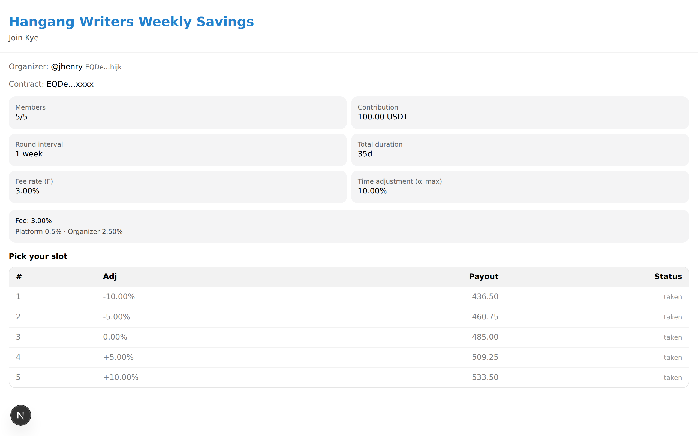
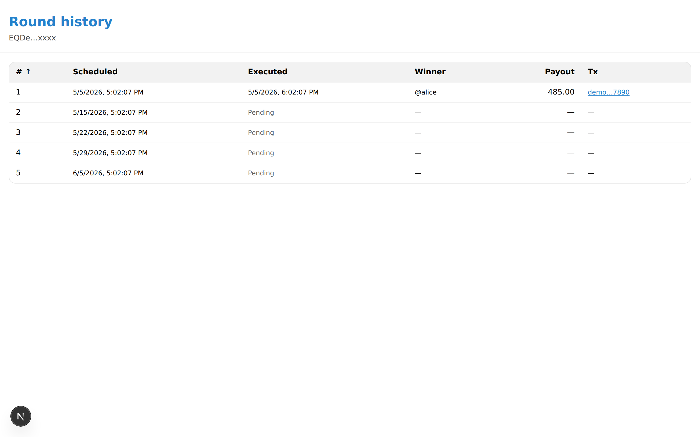
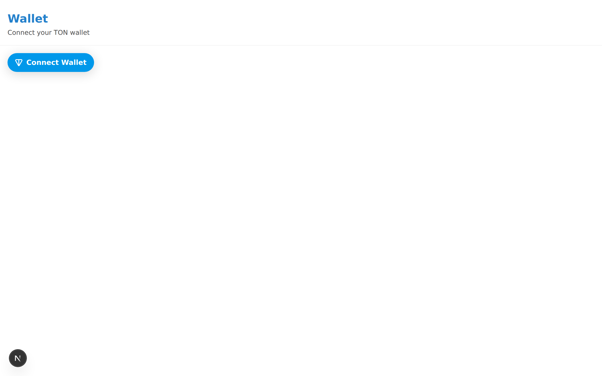

# Member Guide

For people joining a circle a friend or acquaintance has organized.

---

## 1. Open the invite link

Tap the link your organizer sent (e.g. `https://t.me/RoostaBot?start=join_EQAbc...`). The bot opens and shows a **View circle** button. Tapping it launches the Mini App with the circle details already loaded.

## 2. Reading the payout table

This is the screen that matters most. Read it carefully before you join.

The table has N rows, one per slot:

| Slot k | Receive at | Payout (USDT) | Total paid in by then (USDT) | Net (USDT) |
|---|---|---|---|---|
| 1 | Week 1 | 96.5 | 10 | +86.5 (effectively a zero-interest loan) |
| ... | ... | ... | ... | ... |
| N | Week N | 103.5 | 100 (fully paid in) | +3.5 (savings-style return) |

- **Early slots (k=1, 2):** smaller payout, but you get it sooner. Useful if you need short-term liquidity.
- **Late slots (k=N-1, N):** larger payout, courtesy of the time adjustment α_max. Useful as savings.
- **Middle slots:** payout near the average. Stable but not differentiated.

## 3. Understanding the warnings

Depending on the circle's parameters, up to four warnings can appear:

1. **"Slot 1 receives less than 80% of the pool"** — F + α_max exceeds 20%. Early slots carry more cost than usual.
2. **"Fee well above market average"** — F > 10%. The organizer's cut is unusually large.
3. **"Large gap between slots"** — α_max > 30%. Big difference between slot 1 and slot N payouts.
4. **"Long-running circle (over 12 months)"** — interval × N exceeds a year. Higher chance your situation changes mid-circle.

**If any warning is present, the consent checkbox is required.** Read carefully before checking it.

## 4. Choosing a slot

Organizers often preassign slots, but if it's negotiable, pick based on your situation:

- **Early slot:** closest to a zero-interest loan. You still owe contributions for the remaining N-1 rounds; bailing early means heavy loss and the default policy applies.
- **Late slot:** closest to savings. Funds are locked for N weeks but the payout is stable. Best if your cashflow is predictable.
- **Middle slot:** average risk and return. A safe first pick.

## 5. Connect your TON wallet

The Mini App shows a **Connect wallet** button. TON Connect supports Tonkeeper, MyTonWallet, and others.

If you don't have a wallet, install Tonkeeper first and top it up with USDT. Recommended balance: `N × C + 5 USDT` (the 5 is buffer).

## 6. What the join transaction does

Submitting the join transaction does two things at once:

1. **Reserves your slot** — your wallet address is written to the contract's member slot.
2. **Grants auto-withdraw permission** — each round, the contract is allowed to pull exactly C USDT from your wallet via the USDT jetton.

> **Scoped permission.** Auto-withdraw only works for **this contract**, only **once per round**, and only up to **C USDT**. Other contracts and other amounts are not allowed.

The permission expires automatically when the circle completes or is cancelled.

## 7. What happens each round

- **24 hours before:** the bot DMs you "C USDT will be withdrawn tomorrow at X — check your balance" with a **Top up** button.
- **At round execution:** the contract pulls C USDT from every member's wallet, distributes fees, and sends the payout to that round's winner.
- **Result notification:** the group chat sees "This week X received N USDT".

## 8. Receiving your payout

When it's your slot, the bot DMs you the amount and the transaction hash.

- Amount: matches the value in your row of the payout table.
- Timing: typically within 30 seconds of the execution transaction confirming.
- Transaction hash: clickable Tonscan link included.

After receiving, **you still owe contributions for the remaining rounds**. Disappearing after a payout triggers the default policy and damages your reputation going forward.

## 9. If a default happens

**You miss a contribution (insufficient balance):**
- The bot DMs you immediately. Top up within 24 hours and the round retries automatically.
- After 24 hours, the default policy applies. You may take a loss too.

**Another member misses:**
- The group chat is notified. Nothing for you to do directly.
- The default policy decides the outcome:
  - **ProRata:** that round's payout shrinks proportionally (fair).
  - **Cancel:** the circle ends; remaining balance refunded pro-rata.
  - **OrganizerCover:** the organizer covers the shortfall; you're unaffected.

## 10. Completion

After the last round, the bot sends a completion summary. Auto-withdraw permission expires automatically — no further withdrawals can happen from your wallet. If you want to start another circle with the same group, the Mini App offers a one-tap option.
