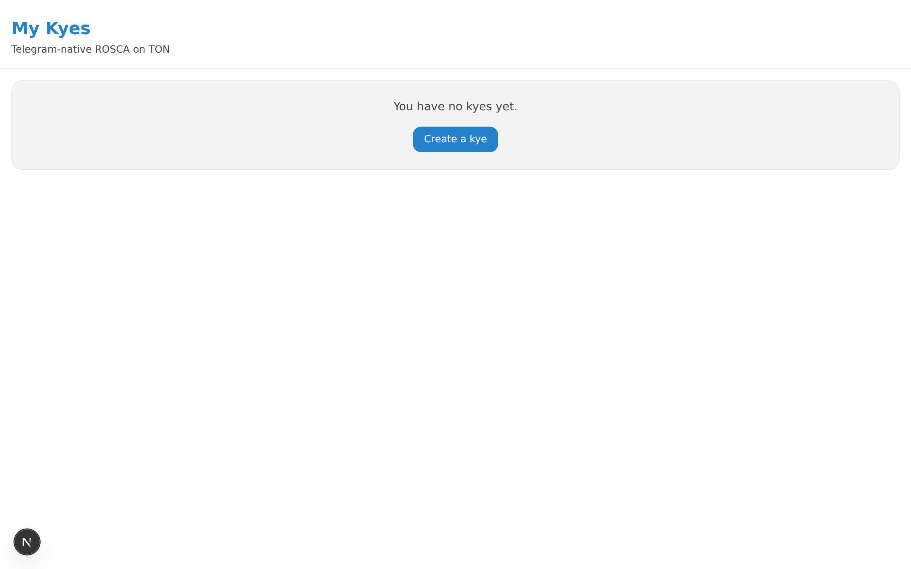
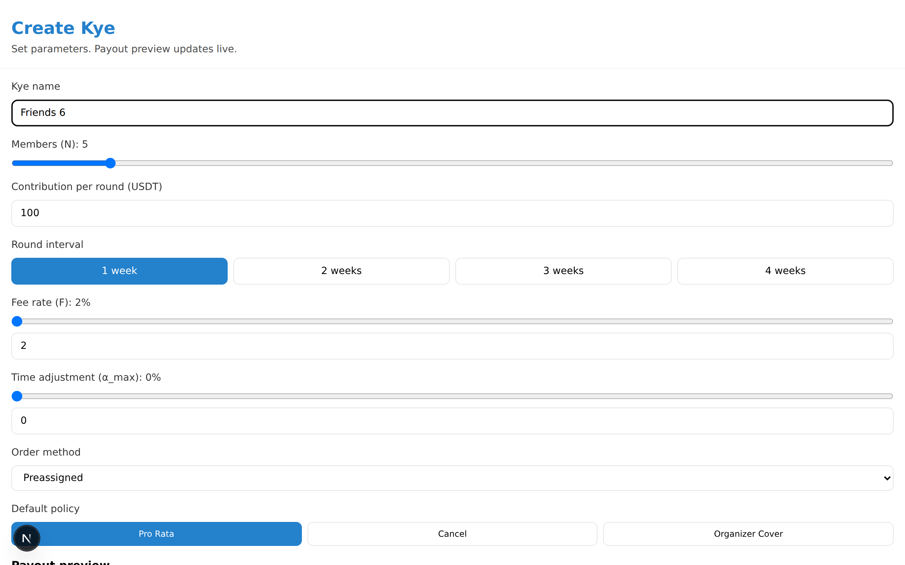
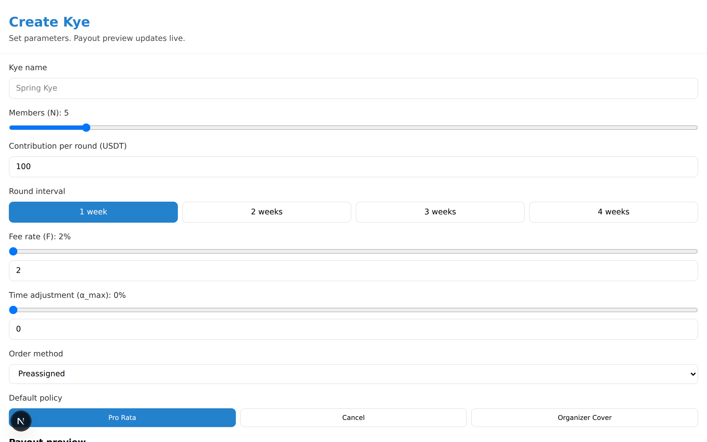
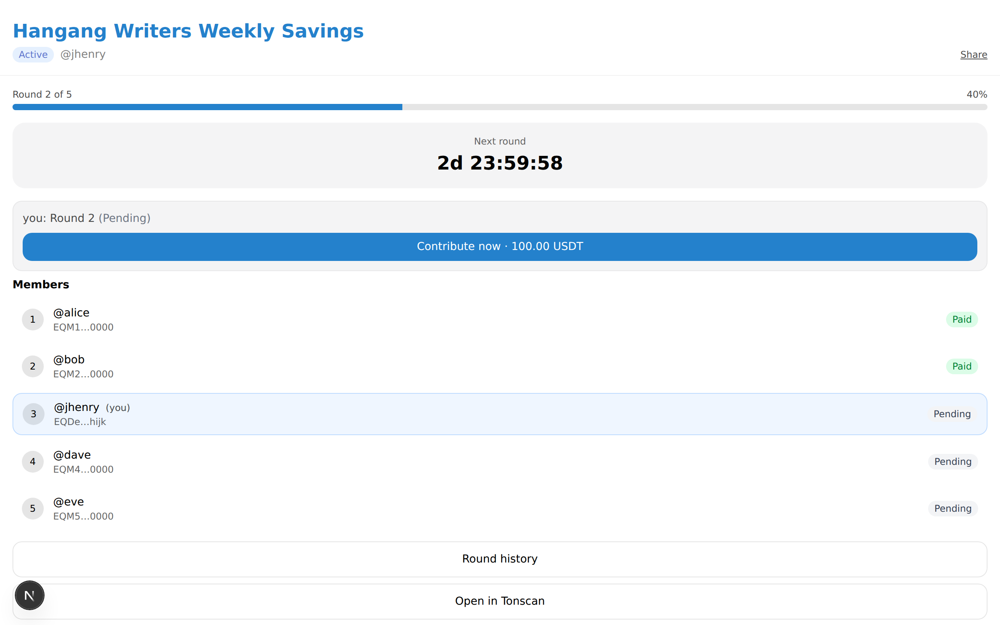
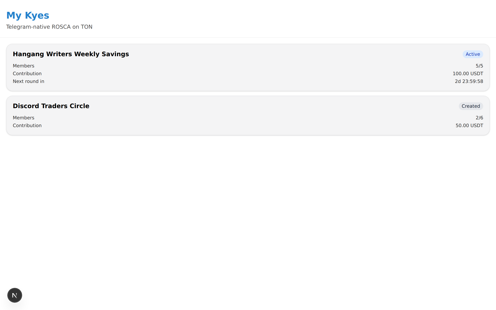

# Organizer Guide

For people who want to start and run a circle on Roosta. The organizer is the operational owner of the circle and earns a share of the round fee in return.

---

## 1. Start the bot

In Telegram, search for `@RoostaBot` and send `/start`.

The bot greets you and shows two buttons: **Create circle** and **My circles**. First-time users should tap **Create circle** — the Mini App opens.

## 2. Create a new circle

From the Home screen, tap **+ New circle** in the top right.

Fill in the name, a short description, and (optionally) link a Telegram group. If you add the bot to your group chat, join notifications and round results post there automatically.

## 3. Configure parameters

This is the step that matters most. As you move the sliders, the **per-slot payout table** on the right updates live.

| Parameter | Recommended | Notes |
|---|---|---|
| **Members N** | 5–12 | Max 30. More members widens the gap between slot 1 and slot N. For a first circle, around 6 is comfortable. |
| **Contribution C** | 10–50 USDT | Pick an amount every member can pay weekly without strain. Larger amounts raise default risk. |
| **Round interval** | Weekly | Choose 1/2/3/4 weeks. Weekly is the standard and keeps notification fatigue low. |
| **Fee rate F** | 2–4% | Minimum is 2% (200 bps). 0.5% goes to the platform; the rest goes to you. Anything over 10% triggers a warning. |
| **α_max (time adjustment)** | 5–15% | 0% means every slot gets the same payout. Larger values make slot 1 receive less and slot N receive more. Over 30% triggers a warning. |
| **Default policy** | ProRata (recommended) | If someone misses a contribution, payouts scale down proportionally. Fairest and least disputed. *Cancel* terminates the circle immediately. *OrganizerCover* asks you to cover the shortfall. |

**Combined caution.** If `F + α_max` exceeds 20%, the UI warns that slot 1 gets less than 80% of the pool. Slot-1 members may push back. For your first circle, keep the combined value within 15%.

**Duration caution.** Weekly × 30 members = 30 weeks (~7 months). 4-weekly × 30 = 120 weeks (over 2 years). Anything past 12 months triggers a long-circle warning. Start with something you can finish inside 3 months.

## 4. Share the invite link

After locking parameters and tapping **Create circle**, the contract deploys and the bot DMs you the invite link.

Link format: `https://t.me/RoostaBot?start=join_<contract_address>`

- Share the link with friends via DM, group chat, or any other messenger.
- Anyone who taps the link will be walked through joining by the bot.
- You (the organizer) cannot join your own circle — the contract blocks it.

## 5. Vetting members

Roosta is non-custodial infrastructure. The success of a circle comes down to **how well you vet the members**.

- **Start with people you know.** For a first circle, fill the slots yourself with friends. Open recruiting has a much higher default rate.
- **Sanity-check wallet balance.** Before someone joins, check that their USDT balance is at least `N × C`. Members running tight are a risk.
- **Get a second contact channel.** Phone numbers, in addition to Telegram. When defaults happen, fast contact matters.
- **Agree on slot order up front.** Slot 1 is effectively a zero-interest short-term loan; slot N is a fixed-return savings plan. Assign slots based on each member's cashflow situation.

## 6. Monitor rounds

The **circle detail** page shows live state.

- Next round execution time
- Each member's wallet balance (sufficient / short)
- Past round payouts (with Tonscan links)
- Cumulative fee earnings

24 hours before each round, the bot pings every member to top up. You don't need to chase people manually.

## 7. Handling defaults

If automatic withdrawal fails for a member, the contract emits `DefaultDetected` and the bot DMs both you and the member immediately.

- **24-hour grace.** The bot asks the defaulter to top up within 24 hours. Reach out to them directly during that window.
- **Re-execute.** Once they top up, the round automatically retries.
- **Policy kicks in.** If 24 hours pass without resolution, your configured default policy applies:
  - **ProRata:** the round's payout shrinks proportionally; the circle continues.
  - **Cancel:** the circle terminates and remaining balances are refunded pro-rata.
  - **OrganizerCover:** you cover the shortfall (a separate transaction — not automatic).

## 8. After completion

Once the final round executes cleanly, the circle moves to Completed and the bot sends everyone a completion summary.

- Stats: total pool, cumulative fees, default count, average top-up lag
- One-tap action to start a new circle with the same members
- Reputation: this completion is recorded for the organizer reputation NFT planned for V2

Thanks for organizing. Good organizers are the core of the Roosta ecosystem.
